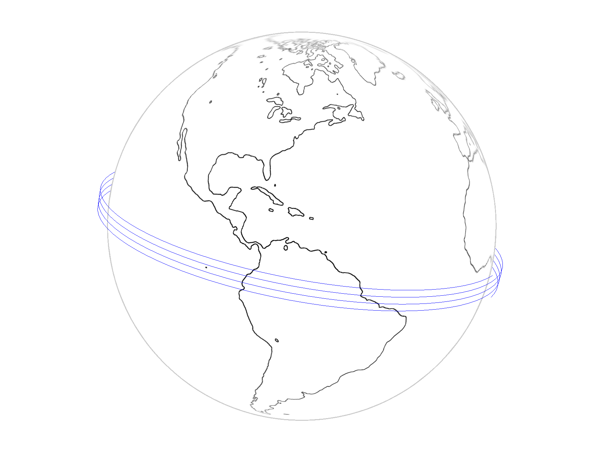

# satellite-orbit

Interactive satellite orbit visualization using <a href="https://threejs.org/">three.js</a>. Check it out at <a href="http://echevarria.io/code/satellite-orbit">echevarria.io</a>

## Controls

- <code>click</code> and drag to rotate the sphere
- <code>scroll</code> to zoom in and out

## Citations

- This project is based on <a href="https://github.com/turban">Bjorn Sandvik</a>'s <a href="https://github.com/turban/webgl-earth">webgl-earth</a>
- Earth outline code was adapted from <a href="https://github.com/stemkoski">Lee Stemkoski</a>'s <a href="https://github.com/stemkoski/stemkoski.github.com/blob/master/Three.js/Outline.html">example</a>